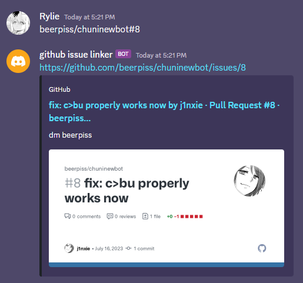

# github issue linker

a Discord bot written in C that links your GitHub issues!



## build instructions

1. dependencies: [`concord`](https://github.com/Cogmasters/concord), [`dotenv-c`](https://github.com/Isty001/dotenv-c) and [`pcre2`](https://www.pcre.org/).
2. install these dependencies as instructed, depending on your operating system.
3. clone the repository.
4. in your shell:

```bash
$ cd github-issue-linker
$ cmake build/ && cmake --build build/
```

the binary file should be found at `./build/github_issue_linker`!

## usage

1. copy `.env.example` and rename it to `.env`.
2. fill in your Discord token, without any quotes.
3. run the binary and the bot should be running.

## license

licensed under the MIT License ([LICENSE](LICENSE) or https://opensource.org/licenses/MIT)

## contribution

unless you explicitly state otherwise, any contribution intentionally submitted
for inclusion by you, shall be licensed as above, without any additional terms
or conditions.